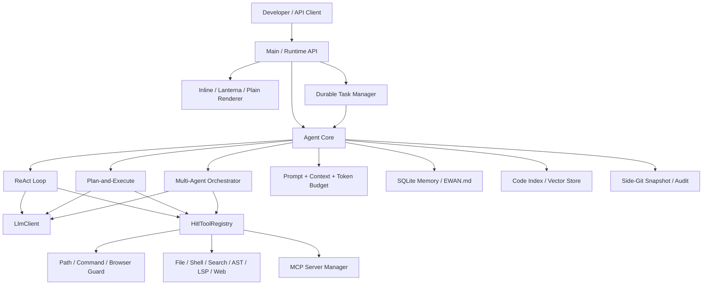
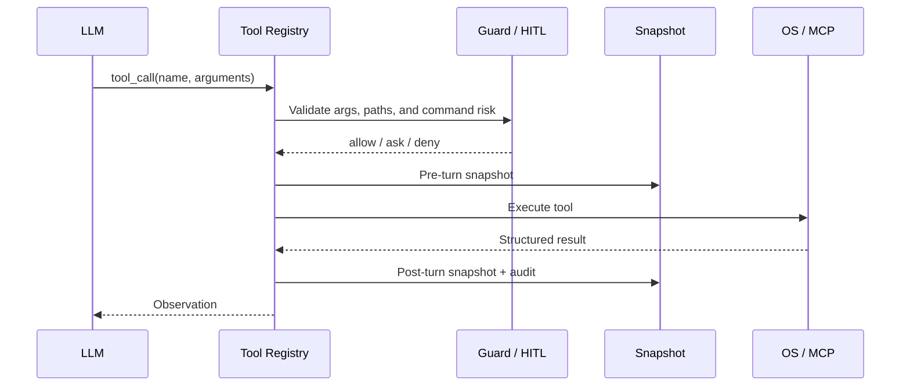

<div align="center">


# Ewancli

<p><strong>English</strong> · <a href="README.zh-CN.md">简体中文</a> · <a href="README.zh-Hant.md">繁體中文</a></p>

### A Java terminal runtime for AI coding agents

[](https://openjdk.org/)
[](https://maven.apache.org/)
[](#execution-models)
[](LICENSE)

Ewancli lets models read code, call tools, and deliver results inside auditable, approval-aware, recoverable boundaries. It includes ReAct, Plan-and-Execute, multi-agent orchestration, MCP, RAG, long-term memory, browser connectivity, and a runtime API.

[Live Run](#live-run) · [Architecture](#architecture) · [Quick Start](#quick-start) · [Interview Perspective](#interview-perspective)

</div>

> The public command and repository name are both **Ewancli**.

## Live Run

This screenshot was produced by the JAR built from this repository. The session used an OpenAI-compatible provider and shows both runtime status and a real model response. No API key was written to a file, log, or screenshot.


```bash
java -jar target/ewancli-1.0-SNAPSHOT.jar
```

## Why This Project Is Worth Inspecting

| Capability | Beyond the checkbox |
| --- | --- |
| Agent loop | Handles streaming, repeated tool calls, observations, context budgets, and termination conditions |
| Three strategies | ReAct, an explicit plan state machine, and Planner/Executor/Reviewer orchestration |
| Tool runtime | Files, shell, search, Java AST, LSP, web, images, and MCP share one registry |
| Safety boundary | Path confinement, command policy, HITL, browser-sensitive-page policy, and audit logs |
| Recovery | Side-Git snapshots state around each turn so failed work can be inspected and restored |
| Context engineering | Token budgets, automatic compaction, SQLite memory, `EWAN.md`, and code RAG |
| Product interfaces | Inline, Lanterna, and Plain renderers plus an HTTP runtime and durable tasks |

## Architecture



### Control plane and execution plane are separate

`Agent` decides what to do next, `ToolRegistry` defines what can be called, and guards plus HITL decide whether the call is allowed now. The policy layer does not manipulate the file system directly, so ReAct, Plan, and multi-agent execution reuse the same tools, safety rules, and audit semantics.

### The runtime is not tied to one UI

Rendering sits behind the `Renderer` interface. Interactive terminals use Inline Renderer, full-screen sessions use Lanterna, and logs or automation use Plain Renderer. The same agent core is also driven by the runtime HTTP API and durable-task manager.

## Execution Models

| Mode | Control flow | Recommended use |
| --- | --- | --- |
| ReAct | Thought -> Tool -> Observation loop | Bug diagnosis, code exploration, short tasks |
| Plan-and-Execute | Create plan -> review -> execute steps -> update state | Refactors, migrations, cross-module changes |
| Multi-Agent | Planner decomposes -> Executor works -> Reviewer verifies | Parallelizable projects and specialist reviews |

```text
/plan Refactor configuration loading and add regression tests
/team Review security, performance, and test coverage in parallel
```

## Tools and Extension

### Built-in engineering tools

- File reads, writes, patching, and directory traversal
- Command execution, `ripgrep` search, and Java AST inspection
- LSP diagnostics, web search/fetch, and image input
- Repository indexing and RAG retrieval
- Side-Git snapshots, audit logs, and background tasks

### MCP

Both stdio and Streamable HTTP transports are supported across tools, resources, prompts, and notification routing.

```text
/mcp
/mcp enable <name>
/mcp restart <name>
/mcp resources <name>
```

The first run generates a default MCP configuration. Review startup commands and permission scopes before connecting a third-party server.

## Safety and Recovery



- `PathGuard` prevents file access outside the workspace.
- `CommandGuard` blocks or escalates dangerous commands.
- `BrowserGuard` distinguishes isolated browsers, shared sessions, and sensitive pages.
- `SnapshotService` and `SideGitManager` provide turn-level history and recovery.
- `SecretRedactor` keeps credentials out of evaluation and tracing artifacts.

## Quick Start

### 1. Build

```bash
git clone https://github.com/xuytwinter/Ewancli.git
cd Ewancli
mvn clean package
```

Requirements: JDK 17+ and Maven 3.9+. `rg` is recommended; some MCP servers also require Node.js and `npx`.

### 2. Configure a model

Create `.env` in the repository root. For the official DeepSeek API:

```dotenv
DEEPSEEK_API_KEY=your-api-key
DEEPSEEK_MODEL=deepseek-chat
```

For a custom OpenAI-compatible endpoint, use the generic provider:

```dotenv
FREELLMAPI_API_KEY=your-api-key
FREELLMAPI_BASE_URL=https://example.com/v1
FREELLMAPI_MODEL=your-model
```

You can also store multiple providers in `~/.ewancli/config.json` and choose a `defaultProvider`. Environment variables take precedence over `.env`.

### 3. Run

```bash
java -jar target/ewancli-1.0-SNAPSHOT.jar
```

Common commands:

| Command | Purpose |
| --- | --- |
| `/plan <task>` / `/team <task>` | Select the strategy for the next task |
| `/model` | Inspect or switch the model |
| `/hitl on` | Require approval for dangerous operations |
| `/index [path]` / `/search <query>` | Build and query the code index |
| `/snapshot status` / `/restore <N>` | Inspect snapshots and restore state |
| `/compact` / `/memory` / `/save` | Manage context and long-term memory |
| `/task add <task>` | Submit a durable background task |
| `/browser connect` | Connect a policy-protected browser session |

## Three Terminal Experiences

```bash
# Default streaming inline UI
EWANCLI_RENDERER=inline java -jar target/ewancli-1.0-SNAPSHOT.jar

# Full-screen TUI
EWANCLI_RENDERER=lanterna java -jar target/ewancli-1.0-SNAPSHOT.jar

# CI, log collection, and automation
EWANCLI_RENDERER=plain java -jar target/ewancli-1.0-SNAPSHOT.jar
```

## Runtime API

```bash
export EWANCLI_RUNTIME_API_KEY=replace-with-a-strong-secret
java -jar target/ewancli-1.0-SNAPSHOT.jar serve --http --port 8080
```

The API exposes threads, events, and tasks. Its runtime authentication key is separate from model-provider credentials.

## Project Layout

```text
src/main/java/com/ewancli/
|-- agent/      # Agent loop, planned execution, multi-role orchestration
|-- tool/       # Tool registration, search engines, execution policy
|-- hitl/       # Human approval and switchable policies
|-- policy/     # Paths, commands, and auditing
|-- mcp/        # Protocol, transports, resources, and prompts
|-- memory/     # Compaction, retrieval, deduplication, long-term memory
|-- rag/        # Code chunking, embeddings, and vector store
|-- snapshot/   # Side-Git turn snapshots
|-- render/     # Inline, Plain, and terminal components
|-- runtime/    # HTTP API, cancellation, and durable tasks
`-- browser/    # Browser connectivity and sensitive-page policy
```

## Development and Verification

```bash
# Fast regression suite
mvn test -Pquick

# Full tests
mvn test -DskipTests=false

# Package
mvn clean package
```

`pom.xml` currently defaults to `skipTests=true`, so a plain `mvn package` checks compilation and packaging only. Run tests explicitly before submitting changes. Coverage spans agents, MCP, RAG, memory, policy, snapshots, TUI, runtime services, browser policy, and the evaluation harness.

## Interview Perspective

1. **Termination and budget control:** preventing infinite tool loops and runaway context.
2. **Unified tool protocol:** sharing invocation, approval, and audit semantics across local and MCP tools.
3. **Recoverable editing:** using an isolated Side-Git store instead of polluting the user's repository history.
4. **Multi-agent boundaries:** dividing roles while constraining messages, turns, and token budgets.
5. **Rendering abstraction:** serving Inline, TUI, Plain, and HTTP interfaces from one runtime.
6. **Replaceable LLMs:** isolating authentication, model differences, retry policy, and streaming behind a provider factory.

## Security

A coding agent can execute local commands and modify files. Run it only in trusted repositories, keep HITL plus path and command protection enabled, and review third-party MCP servers or shared browser sessions carefully. Never commit `.env`, `~/.ewancli`, model keys, runtime keys, or account-state files.

## License

[MIT](LICENSE)
