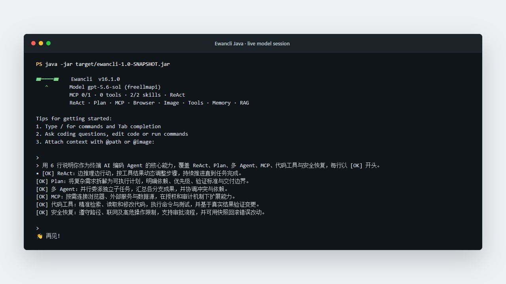
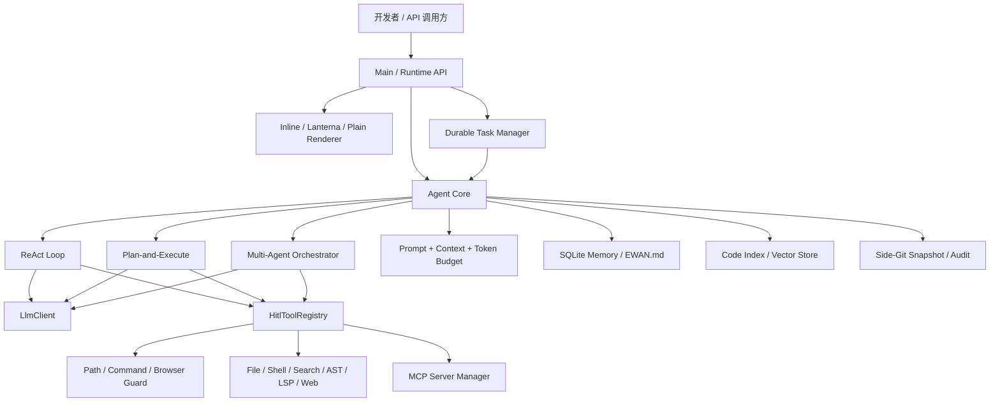
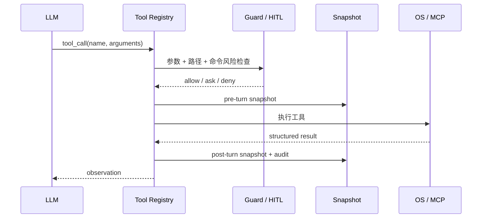

<div align="center">


# Ewancli

<p><a href="README.md">English</a> · <strong>简体中文</strong> · <a href="README.zh-Hant.md">繁體中文</a></p>

### Java 实现的终端 AI 编码 Agent Runtime

[](https://openjdk.org/)
[](https://maven.apache.org/)
[](#执行模型)
[](LICENSE)

让大模型在可审计、可审批、可恢复的边界内读取代码、调用工具并交付结果。支持 ReAct、Plan-and-Execute、多 Agent、MCP、RAG、长期记忆、浏览器连接与 Runtime API。

[真实运行](#真实运行) · [架构设计](#架构设计) · [快速开始](#快速开始) · [面试视角](#面试视角)

</div>

> 项目当前对外命令名为 **Ewancli**，仓库名为 **Ewancli**。

## 真实运行

下图由本仓库构建出的 JAR 真实运行生成。会话通过 OpenAI-compatible Provider 接入模型，截图展示启动状态与实际模型响应；API Key 未写入文件、日志或截图。



```bash
java -jar target/ewancli-1.0-SNAPSHOT.jar
```

## 为什么这个项目值得看

| 能力 | 不止是“有功能” |
| --- | --- |
| Agent Loop | 处理流式响应、多轮工具调用、工具结果回填、上下文预算与终止条件 |
| 三种执行策略 | ReAct、显式计划状态机、Planner / Executor / Reviewer 多角色编排 |
| 工具运行时 | 文件、Shell、搜索、Java AST、LSP、Web、图片与 MCP 共享统一注册中心 |
| 安全边界 | 路径围栏、命令保护、HITL、浏览器敏感页策略、审计日志 |
| 可恢复性 | Side-Git 在 turn 前后建立快照，失败任务可检查并恢复 |
| 上下文工程 | Token Budget、自动压缩、SQLite 长期记忆、`EWAN.md`、代码 RAG |
| 产品化接口 | Inline / Lanterna / Plain 三种渲染器，Runtime HTTP API 与持久化任务 |

## 架构设计



### 控制面与执行面分离

`Agent` 决定“下一步做什么”，`ToolRegistry` 决定“可以调用什么”，Guard 与 HITL 决定“此刻是否允许执行”。策略层不直接操作文件系统，因此 ReAct、Plan 和多 Agent 可以复用相同的工具、安全与审计能力。

### Runtime 不依赖某一种 UI

渲染通过 `Renderer` 接口抽象：交互终端使用 Inline Renderer，需要全屏体验时使用 Lanterna，日志与自动化使用 Plain Renderer；同一个 Agent 还可由 Runtime HTTP API 与后台任务管理器驱动。

## 执行模型

| 模式 | 控制流 | 推荐场景 |
| --- | --- | --- |
| ReAct | Thought → Tool → Observation 循环 | Bug 定位、代码探索、短任务 |
| Plan-and-Execute | 生成计划 → 审阅 → 逐步执行 → 更新状态 | 重构、迁移、跨模块需求 |
| Multi-Agent | Planner 拆解 → Executor 执行 → Reviewer 检查 | 可并行的大型任务、专项评审 |

```text
/plan 重构配置加载并补齐回归测试
/team 并行检查安全、性能和测试覆盖
```

## 工具与扩展

### 内置工程工具

- 文件读取、写入、补丁应用与目录遍历
- 命令执行、`ripgrep` 代码搜索、Java AST 结构分析
- LSP 诊断、网页搜索与抓取、图片输入
- 项目代码索引与 RAG 检索
- Side-Git 快照、审计日志与后台任务

### MCP

支持 stdio 与 Streamable HTTP transport，覆盖 tools、resources、prompts 与通知路由。

```text
/mcp
/mcp enable <name>
/mcp restart <name>
/mcp resources <name>
```

项目首次运行会生成默认 MCP 配置；连接外部 Server 前请检查启动命令与权限范围。

## 安全与恢复



- `PathGuard` 防止工作区外的越界文件操作。
- `CommandGuard` 对危险命令进行阻断或升级审批。
- `BrowserGuard` 区分隔离浏览器、共享会话与敏感页面。
- `SnapshotService` 和 `SideGitManager` 提供 turn 级变更记录与恢复。
- `SecretRedactor` 避免评测与追踪产物携带凭据。

## 快速开始

### 1. 构建

```bash
git clone https://github.com/xuytwinter/Ewancli.git
cd Ewancli
mvn clean package
```

环境要求：JDK 17+、Maven 3.9+；推荐额外安装 `rg`，使用部分 MCP Server 时需要 Node.js / `npx`。

### 2. 配置模型

在仓库根目录创建 `.env`。官方 DeepSeek 接入：

```dotenv
DEEPSEEK_API_KEY=your-api-key
DEEPSEEK_MODEL=deepseek-chat
```

自定义 OpenAI-compatible 地址使用通用 Provider：

```dotenv
FREELLMAPI_API_KEY=your-api-key
FREELLMAPI_BASE_URL=https://example.com/v1
FREELLMAPI_MODEL=your-model
```

也可以在 `~/.ewancli/config.json` 保存多个 Provider 并指定 `defaultProvider`。环境变量优先于 `.env`。

### 3. 运行

```bash
java -jar target/ewancli-1.0-SNAPSHOT.jar
```

常用命令：

| 命令 | 用途 |
| --- | --- |
| `/plan <任务>` / `/team <任务>` | 切换下一次任务的执行策略 |
| `/model` | 查看或切换模型 |
| `/hitl on` | 开启危险操作人工审批 |
| `/index [路径]` / `/search <查询>` | 建立并检索代码索引 |
| `/snapshot status` / `/restore <N>` | 查看快照并恢复 |
| `/compact` / `/memory` / `/save` | 管理上下文与长期记忆 |
| `/task add <任务>` | 提交持久化后台任务 |
| `/browser connect` | 连接受策略保护的浏览器会话 |

## 三种终端体验

```bash
# 默认：流式 inline UI
EWANCLI_RENDERER=inline java -jar target/ewancli-1.0-SNAPSHOT.jar

# 全屏 TUI
EWANCLI_RENDERER=lanterna java -jar target/ewancli-1.0-SNAPSHOT.jar

# CI、日志采集与自动化
EWANCLI_RENDERER=plain java -jar target/ewancli-1.0-SNAPSHOT.jar
```

## Runtime API

```bash
export EWANCLI_RUNTIME_API_KEY=replace-with-a-strong-secret
java -jar target/ewancli-1.0-SNAPSHOT.jar serve --http --port 8080
```

Runtime API 提供线程、事件与任务接口；运行时认证密钥与模型 Provider Key 分离。

## 项目结构

```text
src/main/java/com/ewancli/
├── agent/      # Agent loop、计划执行与多角色编排
├── tool/       # 工具注册、搜索引擎与执行策略
├── hitl/       # 人工审批与可切换策略
├── policy/     # 路径、命令与审计
├── mcp/        # 协议、transport、resources、prompts
├── memory/     # 压缩、检索、去重与长期记忆
├── rag/        # 代码切块、Embedding 与 Vector Store
├── snapshot/   # Side-Git turn 快照
├── render/     # Inline、Plain 与终端组件
├── runtime/    # HTTP API、取消令牌与持久化任务
└── browser/    # 浏览器连接与敏感页面策略
```

## 开发与验证

```bash
# 快速回归
mvn test -Pquick

# 完整测试
mvn test -DskipTests=false

# 打包
mvn clean package
```

`pom.xml` 当前默认 `skipTests=true`，所以普通 `mvn package` 只验证编译与打包；提交前请显式运行测试。测试覆盖 Agent、MCP、RAG、Memory、Policy、Snapshot、TUI、Runtime、浏览器策略和评测 Harness 等模块。

## 面试视角

1. **Agent 的终止与预算控制**：如何避免无限工具循环和上下文失控。
2. **统一工具协议**：本地工具与 MCP 工具如何共享调用、审批、审计语义。
3. **可恢复编辑**：为什么选择独立 Side-Git，而不是污染用户现有 Git 历史。
4. **多 Agent 边界**：如何拆分角色，同时限制消息、轮次与 Token 预算。
5. **终端渲染抽象**：为什么同一 Runtime 可以同时服务 Inline、TUI、Plain 和 HTTP。
6. **LLM 可替换性**：Provider Factory 如何隔离认证、模型差异、重试与流式协议。

## 安全提示

编码 Agent 能够执行本机命令并修改文件。请在可信仓库中运行，保留 HITL、路径保护与命令保护，并谨慎授权第三方 MCP Server 或共享浏览器会话。不要提交 `.env`、`~/.ewancli`、模型 Key、Runtime Key 或账号状态文件。

## License

[MIT](LICENSE)
