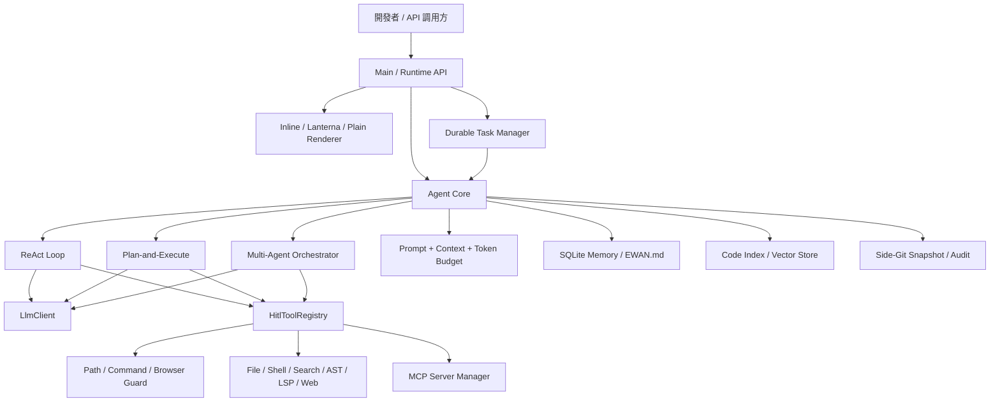
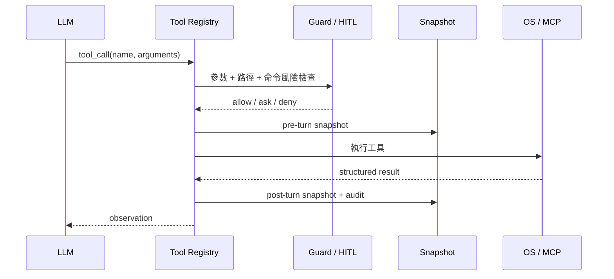

<div align="center">


# Ewancli

<p><a href="README.md">English</a> · <a href="README.zh-CN.md">简体中文</a> · <strong>繁體中文</strong></p>

### Java 實現的終端 AI 編碼 Agent Runtime

[](https://openjdk.org/)
[](https://maven.apache.org/)
[](#執行模型)
[](LICENSE)

讓大模型在可審計、可審批、可恢復的邊界內讀取代碼、調用工具並交付結果。支持 ReAct、Plan-and-Execute、多 Agent、MCP、RAG、長期記憶、瀏覽器連接與 Runtime API。

[真實運行](#真實運行) · [架構設計](#架構設計) · [快速開始](#快速開始) · [面試視角](#面試視角)

</div>

> 項目當前對外命令名爲 **Ewancli**，倉庫名爲 **Ewancli**。

## 真實運行

下圖由本倉庫構建出的 JAR 真實運行生成。會話通過 OpenAI-compatible Provider 接入模型，截圖展示啓動狀態與實際模型響應；API Key 未寫入文件、日誌或截圖。


```bash
java -jar target/ewancli-1.0-SNAPSHOT.jar
```

## 爲什麼這個項目值得看

| 能力 | 不止是“有功能” |
| --- | --- |
| Agent Loop | 處理流式響應、多輪工具調用、工具結果回填、上下文預算與終止條件 |
| 三種執行策略 | ReAct、顯式計劃狀態機、Planner / Executor / Reviewer 多角色編排 |
| 工具運行時 | 文件、Shell、搜索、Java AST、LSP、Web、圖片與 MCP 共享統一註冊中心 |
| 安全邊界 | 路徑圍欄、命令保護、HITL、瀏覽器敏感頁策略、審計日誌 |
| 可恢復性 | Side-Git 在 turn 前後建立快照，失敗任務可檢查並恢復 |
| 上下文工程 | Token Budget、自動壓縮、SQLite 長期記憶、`EWAN.md`、代碼 RAG |
| 產品化接口 | Inline / Lanterna / Plain 三種渲染器，Runtime HTTP API 與持久化任務 |

## 架構設計



### 控制面與執行面分離

`Agent` 決定“下一步做什麼”，`ToolRegistry` 決定“可以調用什麼”，Guard 與 HITL 決定“此刻是否允許執行”。策略層不直接操作文件系統，因此 ReAct、Plan 和多 Agent 可以複用相同的工具、安全與審計能力。

### Runtime 不依賴某一種 UI

渲染通過 `Renderer` 接口抽象：交互終端使用 Inline Renderer，需要全屏體驗時使用 Lanterna，日誌與自動化使用 Plain Renderer；同一個 Agent 還可由 Runtime HTTP API 與後臺任務管理器驅動。

## 執行模型

| 模式 | 控制流 | 推薦場景 |
| --- | --- | --- |
| ReAct | Thought → Tool → Observation 循環 | Bug 定位、代碼探索、短任務 |
| Plan-and-Execute | 生成計劃 → 審閱 → 逐步執行 → 更新狀態 | 重構、遷移、跨模塊需求 |
| Multi-Agent | Planner 拆解 → Executor 執行 → Reviewer 檢查 | 可並行的大型任務、專項評審 |

```text
/plan 重構配置加載並補齊迴歸測試
/team 並行檢查安全、性能和測試覆蓋
```

## 工具與擴展

### 內置工程工具

- 文件讀取、寫入、補丁應用與目錄遍歷
- 命令執行、`ripgrep` 代碼搜索、Java AST 結構分析
- LSP 診斷、網頁搜索與抓取、圖片輸入
- 項目代碼索引與 RAG 檢索
- Side-Git 快照、審計日誌與後臺任務

### MCP

支持 stdio 與 Streamable HTTP transport，覆蓋 tools、resources、prompts 與通知路由。

```text
/mcp
/mcp enable <name>
/mcp restart <name>
/mcp resources <name>
```

項目首次運行會生成默認 MCP 配置；連接外部 Server 前請檢查啓動命令與權限範圍。

## 安全與恢復



- `PathGuard` 防止工作區外的越界文件操作。
- `CommandGuard` 對危險命令進行阻斷或升級審批。
- `BrowserGuard` 區分隔離瀏覽器、共享會話與敏感頁面。
- `SnapshotService` 和 `SideGitManager` 提供 turn 級變更記錄與恢復。
- `SecretRedactor` 避免評測與追蹤產物攜帶憑據。

## 快速開始

### 1. 構建

```bash
git clone https://github.com/xuytwinter/Ewancli.git
cd Ewancli
mvn clean package
```

環境要求：JDK 17+、Maven 3.9+；推薦額外安裝 `rg`，使用部分 MCP Server 時需要 Node.js / `npx`。

### 2. 配置模型

在倉庫根目錄創建 `.env`。官方 DeepSeek 接入：

```dotenv
DEEPSEEK_API_KEY=your-api-key
DEEPSEEK_MODEL=deepseek-chat
```

自定義 OpenAI-compatible 地址使用通用 Provider：

```dotenv
FREELLMAPI_API_KEY=your-api-key
FREELLMAPI_BASE_URL=https://example.com/v1
FREELLMAPI_MODEL=your-model
```

也可以在 `~/.ewancli/config.json` 保存多個 Provider 並指定 `defaultProvider`。環境變量優先於 `.env`。

### 3. 運行

```bash
java -jar target/ewancli-1.0-SNAPSHOT.jar
```

常用命令：

| 命令 | 用途 |
| --- | --- |
| `/plan <任務>` / `/team <任務>` | 切換下一次任務的執行策略 |
| `/model` | 查看或切換模型 |
| `/hitl on` | 開啓危險操作人工審批 |
| `/index [路徑]` / `/search <查詢>` | 建立並檢索代碼索引 |
| `/snapshot status` / `/restore <N>` | 查看快照並恢復 |
| `/compact` / `/memory` / `/save` | 管理上下文與長期記憶 |
| `/task add <任務>` | 提交持久化後臺任務 |
| `/browser connect` | 連接受策略保護的瀏覽器會話 |

## 三種終端體驗

```bash
# 默認：流式 inline UI
EWANCLI_RENDERER=inline java -jar target/ewancli-1.0-SNAPSHOT.jar

# 全屏 TUI
EWANCLI_RENDERER=lanterna java -jar target/ewancli-1.0-SNAPSHOT.jar

# CI、日誌採集與自動化
EWANCLI_RENDERER=plain java -jar target/ewancli-1.0-SNAPSHOT.jar
```

## Runtime API

```bash
export EWANCLI_RUNTIME_API_KEY=replace-with-a-strong-secret
java -jar target/ewancli-1.0-SNAPSHOT.jar serve --http --port 8080
```

Runtime API 提供線程、事件與任務接口；運行時認證密鑰與模型 Provider Key 分離。

## 項目結構

```text
src/main/java/com/ewancli/
├── agent/      # Agent loop、計劃執行與多角色編排
├── tool/       # 工具註冊、搜索引擎與執行策略
├── hitl/       # 人工審批與可切換策略
├── policy/     # 路徑、命令與審計
├── mcp/        # 協議、transport、resources、prompts
├── memory/     # 壓縮、檢索、去重與長期記憶
├── rag/        # 代碼切塊、Embedding 與 Vector Store
├── snapshot/   # Side-Git turn 快照
├── render/     # Inline、Plain 與終端組件
├── runtime/    # HTTP API、取消令牌與持久化任務
└── browser/    # 瀏覽器連接與敏感頁面策略
```

## 開發與驗證

```bash
# 快速回歸
mvn test -Pquick

# 完整測試
mvn test -DskipTests=false

# 打包
mvn clean package
```

`pom.xml` 當前默認 `skipTests=true`，所以普通 `mvn package` 只驗證編譯與打包；提交前請顯式運行測試。測試覆蓋 Agent、MCP、RAG、Memory、Policy、Snapshot、TUI、Runtime、瀏覽器策略和評測 Harness 等模塊。

## 面試視角

1. **Agent 的終止與預算控制**：如何避免無限工具循環和上下文失控。
2. **統一工具協議**：本地工具與 MCP 工具如何共享調用、審批、審計語義。
3. **可恢復編輯**：爲什麼選擇獨立 Side-Git，而不是污染用戶現有 Git 歷史。
4. **多 Agent 邊界**：如何拆分角色，同時限制消息、輪次與 Token 預算。
5. **終端渲染抽象**：爲什麼同一 Runtime 可以同時服務 Inline、TUI、Plain 和 HTTP。
6. **LLM 可替換性**：Provider Factory 如何隔離認證、模型差異、重試與流式協議。

## 安全提示

編碼 Agent 能夠執行本機命令並修改文件。請在可信倉庫中運行，保留 HITL、路徑保護與命令保護，並謹慎授權第三方 MCP Server 或共享瀏覽器會話。不要提交 `.env`、`~/.ewancli`、模型 Key、Runtime Key 或賬號狀態文件。

## License

[MIT](LICENSE)
